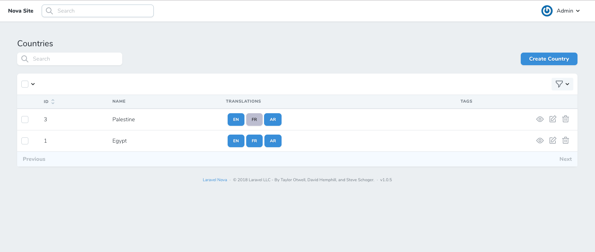

# Multilingual Nova (using default nova fields)

[](https://packagist.org/packages/digitalcloud/multilingual-nova)
[](https://packagist.org/packages/digitalcloud/multilingual-nova)

This package allows you to switch Nova language. Languages could be retrieved as array from config file or from database.

### Requirements

| Requirements | Version |
|--------------|---------|
| PHP          | ^8.0+   |
| Laravel      | ^8.0, 9 |
| Laravel Nova |  ~3.0   |

### Installation

You can install the package via composer:

```bash
composer require digitalcloud/multilingual-nova
```

You can publish the config file:

```shell
php artisan vendor:publish --provider="Digitalcloud\MultilingualNova\FieldServiceProvider"
```

This is the content of the file which will be published at `config/multilingual.php`

```php
<?php

return [

    /*
     * The source of supported locales on the application.
     * Available selection "array", "database". Default array.
     * When you set source "array" you can declare your languages from below at locales.
     * And when you set source "database" you can declare languages model from below and follow database instructions.
    */
    'source' => 'array',

    /*
     * If you choose array selection, you should add all supported translation on it as "code" => "label"
     */
    'locales' => [
        'en' => 'English',
        'ar' => 'Arabic',
        'de' => 'Deutsch'
    ],

    /*
     * If you choose database selection, you should create or choose the model responsible for retrieving supported translations.
     * If there is not existed model for retrieving supported translations, you must create a new model and must contain two columns from values "code_field", "label_field".
     * And choose the 'code_field' for example "en","ar","ru"...
     * And choose the 'label_field' which will be shown for users, for example "English","EN", ....
     */
    'database' => [
        'model' => 'App\\Language',
        'code_field' => 'code',
        'label_field' => 'label'
    ],

    /*
     * The view style you want to show on index & details page.
     * Available selection "button", "list", "mix" default button.
     */
    'style' => 'button',

    /*
     * If you choose mix selection, you can define after how many languages should the button convert to list.
     */
    'convert_to_list_after' => 3
];
```

## Usage

### Nova Language Tool

You can use it as a tool by registering it with Nova. This is typically done in the tools method of the NovaServiceProvider, in `app/Providers/NovaServiceProvider.php`.

```php

use Digitalcloud\MultilingualNova\NovaLanguageTool;
// ....

public function tools()
{
    return [
        // ...
        new NovaLanguageTool(),
        // ...
    ];
}

```

### Nova Language Field:

You can add `Multilingual` field which will show languages to your resource.

```php
    use Digitalcloud\MultilingualNova\Multilingual;
    
    // ....
    
    public function fields(Request $request)
    {
        return [
            // ...
            Multilingual::make('Language'),
            // ...
        ];
    }
```
Note: the field is a virtual field, and it's not required to be a database column. You can consider it as a language switcher input.

In index and detail page, the field will allow you to go to edit form with the selected language.
In create and update page, the field allows you to change the language of inputs in the form in easy and direct way.

### Model:

We use [Spatie laravel translatable](https://github.com/spatie/laravel-translatable)

```php
    use Spatie\Translatable\HasTranslations;
    
    // ....
    
    class User extends Model
    {
    
    use HasTranslations;
    
    protected $fillable = ['name'];

    protected $translatable = ['name'];
 
    }

```

### Defining Locales

You can set the source of locales in the config file. Possible options is array or database.
In case your language source is array, you need to add allowed languages in the locales array in the config file.
When your language source is database, you need to configure the eloquent model of the language table, the column of the language code and the column of the language label.

Alternatively, you can override the config locales using `setLocales(...)` function:

```php
    use Digitalcloud\MultilingualNova\Multilingual;
    
    // ....
    
    public function fields(Request $request)
    {
        return [
            // ...
            Multilingual::make('Language')->setLocales([
                  'ar' => 'Arabic',
                  'en' => 'English',
                  'de' => 'Deutsch',
            ]),
            // ...
        ];
    }
```

### Testing

```bash
composer test
```

### Changelog
Please see [CHANGELOG](CHANGELOG.md) for more information on what has changed recently.

## Security Vulnerabilities

Please review [our security policy](../../security/policy) on how to report security vulnerabilities.


### Displaying Options
 
This tool allows you to switch between displaying style of the language selector field. Possible displaying options are button, list or mix.
By default, the displaying style is `button`. If the field has a translation of a specific language, the button will be a blue one - primary button, and if no translation available the button will be grey - default button. 

If your application supports many languages, this `button` displaying style is not suitable, so `list` displaying will be more suitable.
With `list` displaying, locales are grouped in a dropdown list, allowing you to select an option from this list.

Other perfect option for displaying languages, is `mix`. It allows you to mix between `button` and `list` displaying options. For example, if the system supported
less than three locales, then they will display as `button` otherwise `list` will be selected. This case can be achieved by setting the
`convert_to_list_after` in the config file with 3 or whatever value you want.

### Features

* Display supported locales in the index view.
* Allow you to edit any resource in any supported locale.
* NO ADDITIONAL FIELDS, just use the default laravel form fields.
* Quick switch between languages in index, details, create and update pages.
* Support Relations fields and sub tables.
* Auto fill form fields with default/fallback language content.
* Display translated/untranslated status for each locale.
* List the supported locale using Config file.

### Roadmap

* [x] Display translated/untranslated status for each locale.
* [x] List the supported locale using Config file.
* [x] Manage the supported locale using Database resource.
* [ ] Autodetect translatable Models.
* [ ] Better support for untranslatable fields. 

### Screenshots
##### Index page

##### Create/Update page

##### Language Tool


